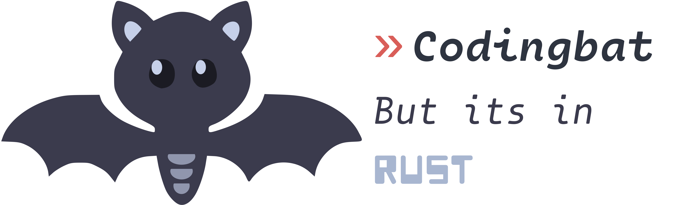

The codingbat solutions, but in rust, because its fun

- I made this because i needed an excuse to practice rust. 

- I don't like reading too much. I prefer to bash my head against the keyboard.

- I try to do a codingbat or two a day, tho, sometimes i forget to push haha!

- Anyway, I'm avaiable for intership, plz hire me I'm gud :3

### Getting Started

To try the terribly implemented tests just run the main.rs file with cargo:

```rust
cargo run
```

And you'll get the results of the current codingbats.

ATM I don't exactly have a proper codingbat testing thingy like its implemented in rustlings, as I still haven't learned proper testing aside of using println!()

If you wanna put your own codingbat or suggest better coding practice in rust feel free to open an issue or PR. It really helps me to get better at this language, and be a better programmer in general.
